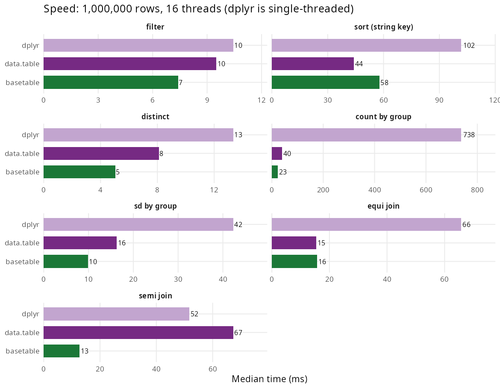
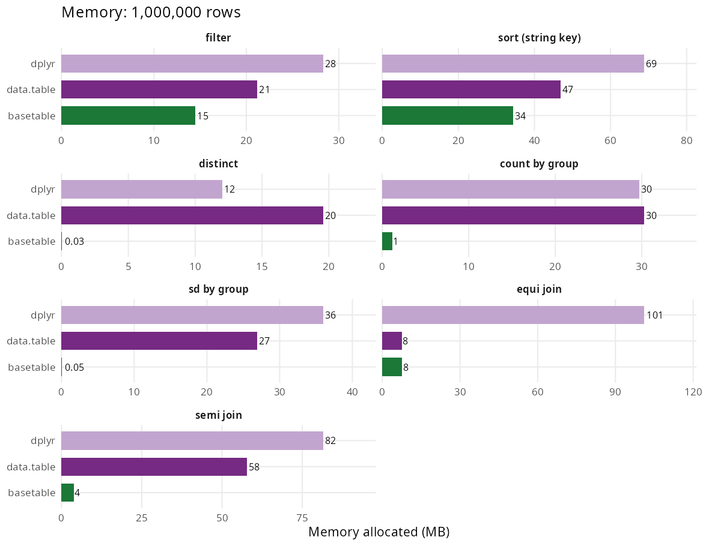

I get more questions about how to actually use `basetable` day to day than about anything in the benchmarks, so this post takes the README and adds worked examples for the handful of functions that carry most of the day-to-day work and the performance story: `subset()`, `transform()`, `aggregate()`, `merge()` / `semimerge()`, and `describe()`. The README itself is unchanged below - the new material is the "Tutorial" section in the middle, and the figures and tables in "Performance" are exactly as published, with a link to the script that generated them.

# basetable

<!-- badges: start -->
[](https://github.com/ielbadisy/basetable/actions/workflows/R-CMD-check.yaml)
[](https://lifecycle.r-lib.org/articles/stages.html#stable)
[](https://opensource.org/licenses/MIT)
<!-- badges: end -->

`basetable` is a fast in-memory data-manipulation package for R with a
**base-R interface** and **no dependencies**. You write `subset()`,
`transform()`, `aggregate()`, `merge()`, `split()`, and the work runs on the
package's own C++ engine. There is no `data.table`, no `dplyr`, no Arrow
underneath, and nothing in `Imports` beyond the base and recommended
packages (`parallel`, `stats`, `utils`).

Every verb returns a `basetable`: an ordinary `data.frame` with one extra
class so it prints compactly and `[` keeps the class. `as.data.frame()`
strips it back to a plain frame.

This is a deliberately focused tool. It is aimed at

- people **teaching or learning base R** who want speed without the cognitive
  load of tidy evaluation or `[i, j, by]`, and
- codebases already built on `subset()` / `merge()` / `aggregate()` that want
  a faster engine **without a rewrite**.

## Design

- **Base-style naming and semantics.** Functions read like `subset()`,
  `transform()`, `aggregate()`, `merge()`, `split()`.
- **A native C++ engine.** Projection, filtering, ordering, distinct,
  grouping, all join kinds, row-bind and `subset()` predicate evaluation run
  in compiled `.Call` kernels. There is no third-party compute backend.
- **Explicit, standard-evaluation interfaces.** Column names are strings, not
  captured symbols (with the marked exceptions `subset()` and `transform()`
  inherit from base R).
- **Zero hard dependencies.** `data.table` and `dplyr` appear only in
  `Suggests`, and only as competitors in the benchmark vignette.

## Installation

```r
# install.packages("pak")
pak::pak("ielbadisy/basetable")
```

## Minimal examples

```{r}
#| label: minimal-examples
# nested
basetable::describe(
  basetable::transform(
    basetable::subset(mtcars, cyl == 6, select = c("mpg", "hp", "wt", "cyl")),
    power = hp / wt
  )
)

# pipe
mtcars |>
  basetable::pick(c("mpg", "hp", "wt", "cyl")) |>
  basetable::transform(power = hp / wt) |>
  basetable::aggregate(by = "cyl", value = c("mpg", "power"), fun = mean)

# table-1 style summary
basetable::summarytab(
  basetable::transform(mtcars, am = factor(am, labels = c("Automatic", "Manual"))),
  vars = c("mpg", "hp"), by = "am", p_value = TRUE
)
```

Every call above is qualified with `basetable::`. That's not just belt and
braces for the README: `basetable` intentionally reuses the base-R names
`subset()`, `transform()`, `merge()` and `split()`, and attaching it with a
plain `library(basetable)` puts those ahead of `base` on the search path for
the rest of the session - which can surprise other code, including tooling,
that calls the base versions unqualified. Qualifying the calls, as in
"[Using basetable alongside dplyr and data.table](#using-basetable-alongside-dplyr-and-data-table)"
below, sidesteps that entirely.

## Tutorial

The examples above are the pitch. The rest of this section is the short
list of functions that carry most of the day-to-day work, one at a time.

### Filtering: `subset()`

Same syntax as `base::subset()` - a condition on the unquoted column
names, plus an optional `select` - running on the C++ engine instead of R:

```{r}
#| label: tut-subset
basetable::subset(mtcars, cyl == 6 & hp > 100, select = c("mpg", "hp", "wt", "cyl"))
```

### Creating columns: `transform()`

Adds or overwrites columns from expressions on the existing ones, and
later expressions in the same call can use columns created earlier in it:

```{r}
#| label: tut-transform
mtcars |>
  basetable::transform(power = hp / wt, efficient = mpg > mean(mpg))
```

### Grouped summaries: `aggregate()`

This is the one with the biggest gap in the benchmarks below - grouped
reductions accumulate in compiled code without materialising intermediate
columns, so a `sd` or a `count` by group allocates close to nothing:

```{r}
#| label: tut-aggregate
basetable::aggregate(airquality, by = "Month", value = c("Ozone", "Temp"), fun = mean, na.rm = TRUE)
```

### Joins: `merge()` and `semimerge()`

`merge()` covers inner, left, right, and full joins through the same
`all` / `all.x` / `all.y` arguments as `base::merge()`, rows come back in
input order rather than sorted by key. `semimerge()` filters one table by
matches in another without adding columns - the join-as-filter case that a
plain `merge()` would otherwise need a follow-up `subset()` for:

```{r}
#| label: tut-merge
left <- data.frame(id = 1:4, x = letters[1:4])
right <- data.frame(id = c(2, 3, 5), y = LETTERS[2:4])

basetable::merge(left, right, by = "id", all.x = TRUE)
basetable::semimerge(left, right, by = "id")
```

### Exploration: `describe()` and `summarytab()`

`describe()` is the quick per-column numeric summary; `summarytab()` builds
a table-1-style comparison across a grouping variable, shown already in
the minimal examples above with a p-value column:

```{r}
#| label: tut-explore
basetable::describe(mtcars)
```

## Performance

Timing and memory below come from the
[`bench`](https://bench.r-lib.org) package at 1,000,000 rows on one Linux
machine. The script that produced both figures and both tables is
[`inst/benchmarks/make-readme-figures.R`](https://github.com/ielbadisy/basetable/blob/main/inst/benchmarks/make-readme-figures.R);
the [`Benchmarks` vignette](https://github.com/ielbadisy/basetable/blob/main/vignettes/benchmarking.Rmd)
has the full reproducible report. `basetable` is compared with `data.table`
and `dplyr`.

### Speed



### Memory



| Operation | basetable | data.table | dplyr | basetable mem | data.table mem | dplyr mem |
| --- | ---: | ---: | ---: | ---: | ---: | ---: |
| filter | 7 ms | 10 ms | 10 ms | 15 MB | 21 MB | 28 MB |
| sort (string key) | 58 ms | 44 ms | 102 ms | 34 MB | 47 MB | 69 MB |
| distinct | 5 ms | 8 ms | 13 ms | 0.03 MB | 20 MB | 12 MB |
| count by group | 23 ms | 40 ms | 738 ms | 1 MB | 30 MB | 30 MB |
| sd by group | 10 ms | 16 ms | 42 ms | 0.05 MB | 27 MB | 36 MB |
| equi join | 16 ms | 15 ms | 66 ms | 8 MB | 8 MB | 101 MB |
| semi join | 13 ms | 67 ms | 52 ms | 4 MB | 58 MB | 82 MB |

(`equi join` pins `data.table` to `sort = FALSE`, matching `basetable::merge()`,
which returns rows in input order.)

`basetable` is faster than `data.table` on `filter`, `distinct`, grouped
`count`, `sd` by group and `semi join`, and is level with it on `equi join`.
Against `dplyr` it is faster on every operation here, by more than 30x on
high-cardinality `count`. The one operation it loses is string `sort`.

### Memory, ranked by advantage

`basetable` allocates the least (or tied least) on every operation measured.
The size of the edge splits in two: overwhelming on grouped reductions,
where the result is tiny and nothing intermediate is materialised in R;
modest on operations that return a full table, where the output frame itself
sets a floor.

| Operation | basetable | data.table | dplyr | basetable vs data.table |
| --- | ---: | ---: | ---: | ---: |
| distinct | 0.03 MB | 20 MB | 12 MB | ~700x less |
| sd by group | 0.05 MB | 27 MB | 36 MB | ~500x less |
| count by group | 1 MB | 30 MB | 30 MB | ~30x less |
| semi join | 4 MB | 58 MB | 82 MB | ~15x less |
| filter | 15 MB | 21 MB | 28 MB | ~1.4x less |
| sort (string key) | 34 MB | 47 MB | 69 MB | ~1.4x less |
| equi join | 8 MB | 8 MB | 101 MB | ~parity |

These are R-level allocations as reported by `bench`. The C++ engine also
uses `malloc`'d scratch buffers (radix keys, per-thread row-position
vectors) that `bench` does not count, so peak process memory during a sort
or filter is higher than the figure above; `data.table` does the same.

The one gap is **sorting**: `orderrows()` is a stable parallel radix, ~20x
faster than base `order()`, but still ~1.3x of `data.table`, whose hand-tuned
parallel radix is the one operation `basetable` does not match.

## Positioning

`data.table` is faster on some workloads (notably sorting) and has a far
larger ecosystem; `dplyr` is the tidyverse standard. `basetable` is a good
fit when you want:

- **base-R syntax** and semantics, not `[i, j, by]`, tidy evaluation, or a
  method-chained frame object;
- **no dependencies** to install, pin, or reason about;
- a package small enough to **read end to end**, teach from, and hand to a
  language model as a stable target;
- competitive speed and best-in-class memory on the everyday operations
  (filter, group, join, distinct) without changing how you write code.

Grouping is a `by` argument on the verb that needs it (`aggregate()`,
`count()`, `summaries()`, `transform()`, `subset()`, `samplerows()`,
`firstby()`, ...), not a stateful `group_by()`. The group is named at the
call and never persists, so there is no `ungroup()` to forget.

## Using basetable alongside dplyr and data.table

`basetable` reuses base-R verb names (`subset()`, `merge()`, `transform()`,
`split()`, `aggregate()`) on purpose. It does **not** ship the dplyr-coined
verbs (`filter()`, `select()`, `mutate()`, `arrange()`, `summarise()`,
`distinct()`, `glimpse()`, ...), so it can be attached next to `dplyr`
without shadowing its grammar. The two names it shares with `dplyr` are
`count()` and `pick()`, kept because they read as base-style verbs; with
both packages attached, whichever was attached **last** wins for those (and
for the base-R names `data.table` also defines). Two fixes:

- call it explicitly: `basetable::transform(...)`;
- or `conflicted::conflict_prefer("transform", "basetable")` once per session.

## Operation dictionary

| Family | Exported functions | Base reference |
| --- | --- | --- |
| Row subsetting | `subset()` | `base::subset()` |
| Column keep / drop / rename | `pick()`, `drop()`, `renamecols()` | `[`, `names<-()` |
| Transformation | `transform()`, `within()` | base equivalents |
| Ordering | `orderrows()` | `order()` |
| Distinct / duplicates | `uniquerows()`, `duplicaterows()`, `removeduplicates()` | `unique()`, `duplicated()` |
| Aggregation | `aggregate()`, `count()`, `summaries()` | `aggregate()`, `table()` |
| Recoding | `recode()`, `collapsevalues()`, `casewhen()`, `replacewhere()` | `ifelse()`, `switch()` |
| Joins | `merge()`, `semimerge()`, `antimerge()`, `updatemerge()`, `crossmerge()`, `nonequimerge()`, `overlapmerge()`, `rangemerge()`, `rollingmerge()` | `merge()` |
| Row / column bind | `rbindfill()` | `rbind()` |
| Split / apply | `split()`, `applyby()` | `split()` |
| Reshaping | `tolong()`, `towide()`, `reshape()`, `stack()`, `unstack()` | base equivalents |
| Completion | `completegrid()` | `expand.grid()` + join |
| File I/O | `btread()`, `btwrite()`; `aggregate()` / `count()` / `uniquerows()` / `freq()` also take a file path | `read.delim()`, fused file to result |
| Inspection | `preview()`, `dims()`, `types()`, `headtail()` | `str()`, `dim()`, `head()` |
| EDA | `describe()`, `missingness()`, `profile()`, `freq()`, `summarytab()`, `compare()` | base summaries |

`btread()` memory-maps the file and, with `lazy = TRUE`, returns columns as
ALTREP vectors parsed on first access. `aggregate()`, `count()`, `uniquerows()`
and `freq()` accept a single file path as their first argument and fuse the
parse with the grouping, so unused columns are never materialised.

## Status

Every exported function has direct test coverage. Vignettes cover getting
started, data manipulation, exploration, a complete function reference, and
benchmarks. CI checks release R on Linux, macOS and Windows plus oldrel and
devel.

<hr>

<footer>
<a href="../index.qmd">Back to blog</a>
</footer>
