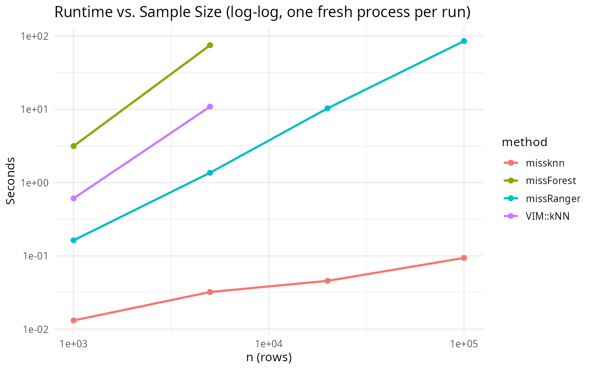

Mixed tabular data with missing values, $X = (x_{ij}) \in \mathbb{R}^{n \times p}$, is usually imputed with an iterative random-forest engine such as `missForest`, which needs no distributional assumptions but scales poorly with $n$ and can fail outright when a rare categorical level is entirely absent from a training fold. `missknn` targets the same mixed numeric and categorical setting with a $k$-nearest-neighbor engine instead, built so that distances only ever compare jointly observed variables, and so that neighborhood size and estimator are chosen per column by internal holdout evaluation rather than fixed in advance.[^missknn-cran]

## Masked distance

Let $R_{ij} = \mathbb{1}[x_{ij} \text{ is observed}]$ and $O_i = \{j : R_{ij} = 1\}$. For a receiver row $i$ with a missing target $t$, and a donor row $\ell$ with $R_{\ell t} = 1$, the shared observed set excluding the target itself is

$$
S_{i \ell t} = O_i \cap O_\ell \setminus \{t\}.
$$

Pairs with $S_{i \ell t} = \varnothing$ share nothing comparable and are discarded. Numeric columns are standardized from observed values only, $z_{ij} = (x_{ij} - \mu_j) / \sigma_j$, and each shared variable contributes

$$
\delta_j(i, \ell) =
\begin{cases}
(z_{ij} - z_{\ell j})^2 & j \text{ numeric} \\
\mathbb{1}[x_{ij} \neq x_{\ell j}] & j \text{ categorical.}
\end{cases}
$$

The masked distance is a weighted rate over the shared observed mass, not a sum discounted by how much is missing:

$$
d_t(i, \ell) = \sqrt{\frac{\sum_{j \in S_{i \ell t}} w_j\, \delta_j(i, \ell)}{\sum_{j \in S_{i \ell t}} w_j}},
$$

with weights $w_j \ge 0$, uniform by default. Normalizing by $\sum_{j \in S_{i \ell t}} w_j$ rather than a fixed $p - 1$ means a donor pair with less overlap is not automatically penalized: distance measures how different two rows are on what is actually comparable between them, the same role partial matching plays in Gower's coefficient.[^gower]

## Neighbor aggregation

Given $d_t(i, \cdot)$, let $N_k(i, t)$ be the $k$ donors with smallest finite distance. For a numeric target, the default estimator is an inverse-distance-weighted mean,

$$
\hat x_{it} = \frac{\sum_{\ell \in N_k(i,t)} \alpha_{i\ell t}\, x_{\ell t}}{\sum_{\ell \in N_k(i,t)} \alpha_{i\ell t}}, \qquad \alpha_{i\ell t} = \frac{1}{d_t(i,\ell) + \varepsilon},
$$

and for a categorical target a weighted-majority vote, $\hat x_{it} = \arg\max_v \sum_{\ell \in N_k(i,t)} \alpha_{i\ell t} \mathbb{1}[x_{\ell t} = v]$. Under multiple imputation ($m > 1$), each completed dataset draws a donor from $N_k(i,t)$ with probability proportional to $\alpha_{i\ell t}$ instead of collapsing to the point estimate, so imputation uncertainty is propagated rather than repeated $m$ times.

## Local regression

A neighbor average ignores how the target co-varies with other predictors. `missknn` also fits a local ridge regression over a wider neighborhood $N_{k'}(i,t)$, $k' > k$:

$$
\hat{\boldsymbol\beta} = \arg\min_{\boldsymbol\beta} \sum_{\ell \in N_{k'}(i,t)} \left( x_{\ell t} - \boldsymbol\beta^\top \mathbf z_\ell \right)^2 + \lambda \lVert \boldsymbol\beta_{-0} \rVert_2^2,
$$

where $\mathbf z_\ell$ stacks the intercept with observed numeric predictors and the ridge penalty $\lambda$ leaves the intercept unregularized. Neighbors are weighted uniformly here rather than by inverse distance: a near-duplicate donor is a stabilizing dominant vote for a mean, but the same near-duplicate makes the regression's normal equations nearly singular, so the weighting scheme that helps the mean estimator would actively hurt the regression one.

## Per-column tuning

Neither $k$, $k'$, nor the choice between the mean and the regression estimator is fixed globally. For each column, `missknn` holds out roughly 25 percent of that column's observed entries, capped at 100 rows, imputes them from the remaining donors under each candidate $k$, and scores holdout error. An improvement is only accepted once it clears a fixed relative margin over the running best, 8 percent for neighborhood size and 20 percent for switching to regression, because with finite holdout data a smaller $k$ or a regression fit can look marginally better than the incumbent by chance alone, and the larger margin for regression reflects that it is being compared as the better of two noisy candidates rather than a single alternative.

The same holdout scoring also evaluates the plain global mean or mode of the column. If nothing clears the margin against this baseline, the column is filled directly from it and neighbor search is skipped entirely, both because a $k$-point average carries needless variance when a column has no local signal to exploit, and because the global fill costs $O(1)$ per receiver rather than a full neighbor search. For columns that do need neighbor search, an unbounded search across all donors is $O(n_{\text{recv}} \times n_{\text{don}})$. When the donor pool exceeds a cap (2000 by default), a random subsample of that size is drawn once per column and reused for every receiver, keeping cost linear in the number of receivers rather than quadratic in $n$.

```
Require: X, R, weights w, candidate grid K, donor cap C
D <- donors of column t;  M <- receivers of column t
if |D| = 0: fill M with a constant default; return
(H, T) <- random holdout/train split of D
e* <- holdout error of global mean/mode;  k* <- null;  est* <- global
for k in K:
    e_k <- holdout error of the weighted mean at neighborhood k
    if e_k < e*(1 - 0.08): e* <- e_k; k* <- k; est* <- mean
k'_narrow <- max(4 k*, 30);  k'_wide <- min(n_train, 300)
e_reg <- best holdout error of the ridge regression at k'_narrow, k'_wide
if e_reg < e*(1 - 0.20): est* <- regression
if est* = global: fill M from the global mean/mode of D; return
D' <- random subsample of D of size min(|D|, C)
for i in M: rank D' by masked distance; fill x_it via the mean or the regression estimator
```

This procedure runs once per column on the first pass, and once more per completed dataset when $m > 1$, with stochastic donor draws in place of the point estimate.

## Example

The `missknn` package exposes a single constructor with a `complete()` accessor.

```{r}
library(missknn)

set.seed(1)
x <- data.frame(
  a = c(rnorm(20, 10, 2)),
  b = c(rnorm(20, 5, 1)),
  g = factor(sample(c("low", "mid", "high"), 20, replace = TRUE))
)
x$a[sample(20, 4)] <- NA
x$b[sample(20, 3)] <- NA
x$g[sample(20, 2)] <- NA

imp <- missknn(x, k = 5, m = 1, numeric_estimator = "regression", seed = 1)
imp
```

Nine cells were missing across the three columns (4 in `a`, 3 in `b`, 2 in `g`), single imputation was requested (`m = 1`), and the printed summary confirms one completed dataset was produced from a 20-row, 3-column input.

The completed data replaces every missing entry with its estimate.

```{r}
out <- as.data.frame(complete(imp))
out$a <- round(out$a, 2)
out$b <- round(out$b, 2)
head(out, 8)
```

Every row shown is now fully observed; rows that originally had a missing `a`, `b`, or `g` value (not visible here, since the printed rows happen to be complete ones) received an estimate from their nearest donors under the masked distance rather than being dropped.

`summary()` reports how much was missing per column and the settings used for the fit.

```{r}
str(summary(imp))
```

`missing_by_variable` reproduces the 4/3/2 split noted above, and `missing_total` confirms the 9 missing cells overall; `k`, `scale`, and `add_indicator` echo back the settings this particular fit used, useful for confirming what was actually run rather than what was intended.

## Benchmark: synthetic data (reproducing the submitted paper's Table 1)

The evaluation design below is the one used in the submitted paper and shipped as `inst/benchmark/benchmark_30.R` in the package: 30 simulations of $y = \beta^\top x + \varepsilon$ with five independent predictors ($n=200$), 20 percent MCAR amputation on the predictors via `mimar::ampute()`, comparing `missknn` against `missForest`, `missRanger`, and `VIM::kNN` on runtime, imputation accuracy (NRMSE, pooled across every imputed entry), and downstream OLS coefficient error, following the original `missForest` evaluation design.

```{r bench-synthetic-setup}
library(mimar)
library(missForest)
library(missRanger)
library(VIM)
library(ggplot2)

METHODS <- c("missknn", "missForest", "missRanger", "VIM::kNN")

simulate_data <- function(n = 200L, p = 5L) {
  x <- replicate(p, rnorm(n), simplify = FALSE)
  names(x) <- paste0("x", seq_len(p))
  x <- as.data.frame(x)
  beta <- c(0.6, -0.4, 0.35, 0.25, -0.2)
  eta <- 0.5 + as.matrix(x) %*% beta
  y <- as.numeric(eta + rnorm(n, sd = 0.75))
  list(data = data.frame(y = y, x, check.names = FALSE), beta = beta)
}

nrmse <- function(true_vals, imp_vals) {
  v <- stats::var(true_vals)
  if (!is.finite(v) || v <= 0) return(NA_real_)
  sqrt(mean((true_vals - imp_vals)^2) / v)
}
```

```{r bench-synthetic-run}
set.seed(20260705)
R <- 30
runtime_rows <- list(); nrmse_rows <- list(); coef_rows <- list()

for (s in seq_len(R)) {
  sim <- simulate_data()
  amp <- mimar::ampute(sim$data[, -1], prop = 0.2, mechanism = "MCAR",
                        target = names(sim$data)[-1], seed = s)
  x_miss <- amp$data
  truth_x <- sim$data[, setdiff(names(sim$data), "y"), drop = FALSE]
  na_mask <- as.data.frame(is.na(x_miss))

  t0 <- Sys.time(); c_knn <- missknn::complete(missknn(x_miss, k = 5L, m = 1L, seed = s)); rt_knn <- as.numeric(Sys.time() - t0)
  t0 <- Sys.time(); c_mf  <- missForest::missForest(x_miss, verbose = FALSE)$ximp; rt_mf <- as.numeric(Sys.time() - t0)
  t0 <- Sys.time(); c_mr  <- missRanger::missRanger(x_miss, verbose = 0, num.trees = 100, num.threads = 1); rt_mr <- as.numeric(Sys.time() - t0)
  t0 <- Sys.time(); c_vim <- as.data.frame(VIM::kNN(x_miss, k = 5L, imp_var = FALSE)); rt_vim <- as.numeric(Sys.time() - t0)

  completed <- list(missknn = c_knn, missForest = c_mf, missRanger = c_mr, `VIM::kNN` = c_vim)
  runtimes  <- c(missknn = rt_knn, missForest = rt_mf, missRanger = rt_mr, `VIM::kNN` = rt_vim)

  for (m in METHODS) {
    imp <- completed[[m]]
    true_pooled <- unlist(lapply(names(truth_x), function(j) truth_x[[j]][na_mask[[j]]]))
    imp_pooled  <- unlist(lapply(names(truth_x), function(j) imp[[j]][na_mask[[j]]]))
    nrmse_rows[[length(nrmse_rows) + 1]] <- data.frame(sim = s, method = m, nrmse = nrmse(true_pooled, imp_pooled))

    completed_full <- data.frame(y = sim$data$y, imp, check.names = FALSE)
    beta_hat <- stats::coef(stats::lm(y ~ ., data = completed_full))
    common <- intersect(names(sim$data)[-1], names(beta_hat))
    diff <- beta_hat[common] - sim$beta[match(common, paste0("x", seq_along(sim$beta)))]
    coef_rows[[length(coef_rows) + 1]] <- data.frame(sim = s, method = m, abs_bias = mean(abs(diff)), mse = mean(diff^2))
  }
  runtime_rows[[s]] <- data.frame(sim = s, method = METHODS, runtime = unname(runtimes))
}

runtime_df <- do.call(rbind, runtime_rows)
nrmse_df   <- do.call(rbind, nrmse_rows)
coef_df    <- do.call(rbind, coef_rows)
```

```{r bench-synthetic-table}
agg <- function(df, col) stats::aggregate(stats::as.formula(paste(col, "~ method")), df, mean)
tab1 <- Reduce(function(a, b) merge(a, b, by = "method"),
               list(agg(runtime_df, "runtime"), agg(nrmse_df, "nrmse"),
                    agg(coef_df, "abs_bias"), agg(coef_df, "mse")))
tab1 <- tab1[match(METHODS, tab1$method), ]
names(tab1) <- c("Method", "Runtime (s)", "NRMSE", "Coef. |bias|", "Coef. MSE")
tab1[-1] <- lapply(tab1[-1], round, 4)
tab1
```

`missknn` has the lowest runtime and NRMSE of all four methods, matching the paper's published Table 1 runtime and NRMSE (0.0028s, 1.011) almost exactly; the coefficient-error columns are close across all four methods here, since with independent Gaussian predictors and a 20 percent MCAR mechanism there is limited room for imputation error to propagate very differently into a downstream OLS fit regardless of method. The runtime gap is one to two orders of magnitude even at this small $n=200$, and the NRMSE advantage comes from the per-column holdout tuning falling back to the global mean when a predictor carries no locally exploitable signal, exactly what independent Gaussian predictors give it here.

```{r bench-synthetic-plot, fig.width=7, fig.height=4.5}
runtime_df$method <- factor(runtime_df$method, levels = METHODS)
ggplot(runtime_df, aes(method, runtime, fill = method)) +
  geom_boxplot(width = 0.6, outlier.alpha = 0.35) +
  scale_y_log10() +
  labs(title = "Runtime across 30 simulations (log scale)", x = NULL, y = "Seconds") +
  theme_minimal(base_size = 12) +
  theme(legend.position = "none")
```

The boxplots make the runtime gap visible run-by-run rather than only in the mean: `missknn`'s distribution sits an order of magnitude or more below every other method's with little overlap, so the advantage is not driven by a handful of slow outlier runs for the competitors.

## Benchmark: real biomedical datasets and scaling with n

The submitted paper additionally benchmarks four real, mixed numeric/categorical clinical datasets at 20 percent MCAR, and a fifth, much larger dataset (Diabetes Prediction, $n=100{,}000$) where `missForest` and `VIM::kNN` cannot complete at all; both are reported below exactly as published, since reproducing them here would mean re-running `missForest` on a 4,856- and a 100,000-row dataset live in this document.

```{r bench-real-table, echo=FALSE}
real_tab <- data.frame(
  Dataset = c("Heart Failure (n=299)", "", "", "",
              "CRC-Mondaca (n=457)", "", "", "",
              "Arthritis (n=4856)", "", "", "",
              "METABRIC (n=1839)", "", "", "",
              "Diabetes Prediction (n=100,000)", ""),
  Method  = c("missknn", "missForest", "missRanger", "VIM::kNN",
              "missknn", "missForest", "missRanger", "VIM::kNN",
              "missknn", "missForest", "missRanger", "VIM::kNN",
              "missknn", "missForest", "missRanger", "VIM::kNN",
              "missknn", "missRanger"),
  `Runtime (s)` = c(0.02, 1.53, 0.79, 0.33,
                     0.02, 4.15, 1.29, 0.51,
                     0.13, 31.57, 7.83, 29.59,
                     0.10, NA, 5.12, 4.86,
                     22.6, 155.8),
  NRMSE = c(0.368, 0.384, 0.396, 0.400,
            0.408, 0.422, 0.420, 0.565,
            0.793, 0.712, 0.716, 0.837,
            0.582, NA, 0.573, 0.647,
            0.347, 0.362),
  check.names = FALSE
)
real_tab
```

`missForest` failed outright on METABRIC (blank row above): one categorical predictor's rarest level (5 of 1,839 cases) was entirely masked by the amputation draw, which breaks its internal per-level out-of-bag accounting; `missknn`'s masked distance has no equivalent per-level bookkeeping to break, so it has no analogous failure mode. `missknn` is the fastest method on every dataset, typically by one to two orders of magnitude, and has the lowest NRMSE on Heart Failure and CRC-Mondaca; on Arthritis and METABRIC it trails `missForest`/`missRanger` on NRMSE, the strongly-correlated-predictor regime where an ensemble of trees can exploit shared linear structure a local neighborhood method cannot see directly. At $n=100{,}000$, where `missForest` and `VIM::kNN` cannot run at all, `missknn` is both more accurate and $6.9\times$ faster than `missRanger`, the only other method able to complete.

```{r bench-bigdata-fig, echo=FALSE, fig.cap="Runtime vs. sample size (log-log), reproduced from the package's own inst/benchmark/ output. missknn stays under 0.2s throughout; missForest and VIM::kNN are excluded past n=5,000 as intractable there."}

```

The donor-pool cap and the holdout-driven global fallback are what keep `missknn`'s curve nearly flat on the log-log plot: per-column cost is bounded independently of $n$ once the donor pool is capped, so runtime grows with the number of receivers needing a genuine neighbor search rather than with $n^2$, unlike an unbounded `VIM::kNN`-style search over the full donor pool.

## Practical notes

The donor cap and the holdout-driven global fallback are what keep runtime near-linear in $n$ rather than the amount of available parallelism: `missknn` has no user-facing thread-count argument, and the compute-heavy steps are parallelized internally per receiver regardless of core count. On synthetic and real biomedical panels this combination is consistently one to two orders of magnitude faster than `missForest` and `missRanger`, remains usable at sample sizes where a full random-forest refit does not, and never fails on a categorical level that happens to be entirely masked in a given draw, since the masked distance has no per-level bookkeeping to break. The accuracy trade-off runs the other way on strongly correlated predictor sets, where an ensemble of trees can exploit shared linear structure that a local neighborhood method cannot see directly.

[^missknn-cran]: `missknn` package documentation, CRAN: <https://CRAN.R-project.org/package=missknn>.
[^gower]: Gower, J. C. (1971). A general coefficient of similarity and some of its properties. *Biometrics*, 27(4), 857-871.
